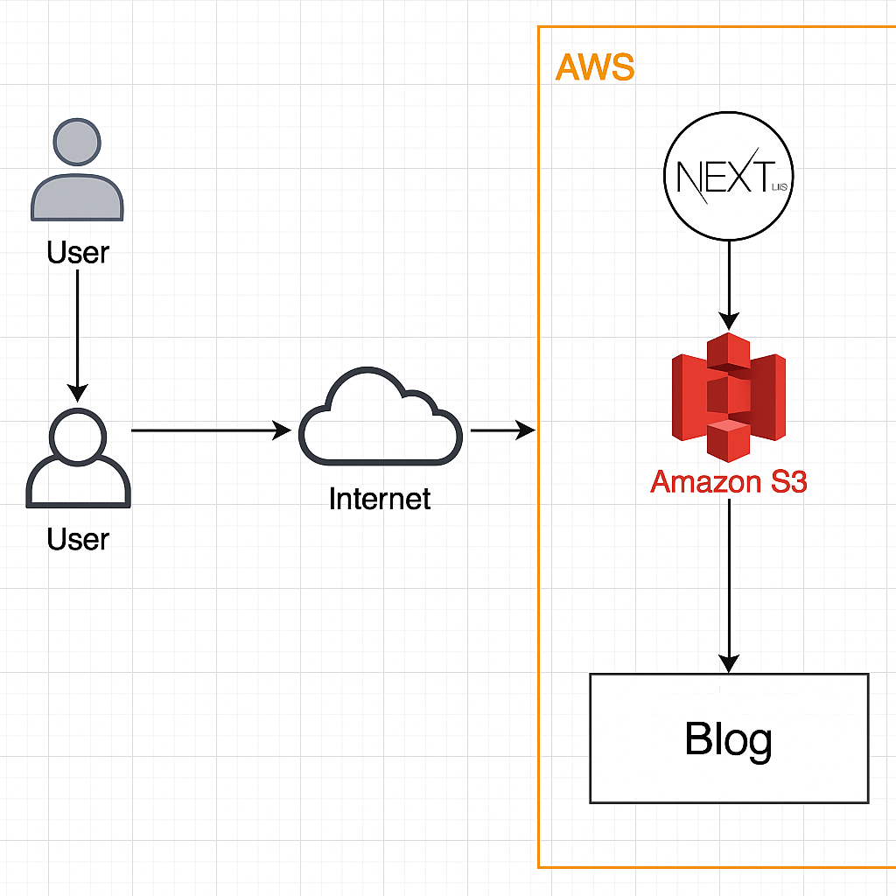

# Documentação Técnica – Blog Estático Grupo SalesPRO

## 1. Visão Geral do Projeto

Este projeto consiste em um blog estático criado com **Next.js**, publicado no serviço **Amazon S3** utilizando hospedagem de site estático. O objetivo é demonstrar deploy de aplicação estática na nuvem, com foco em baixo custo, alta disponibilidade e simplicidade operacional.

## 2. Arquitetura da Solução

- O site é gerado pelo Next.js, que compila a aplicação React para arquivos HTML, CSS e JavaScript estáticos.
- Esses arquivos são armazenados em um bucket do S3 configurado para hospedagem estática com acesso público de leitura.
- Os usuários acessam o blog via URL pública do bucket (endpoint do S3).
- Não há servidores ou backend dinâmico, garantindo simplicidade e custo zero em muitos casos.

## 3. Decisões de Design e Configurações AWS

- **Hospedagem em Amazon S3** para garantir alta disponibilidade e baixo custo.
- Desativação do bloqueio de acesso público para permitir acesso ao conteúdo.
- Uso de ACLs públicas apenas para leitura dos objetos.
- Configuração de documentos padrão para `index.html` e `404.html` para navegação correta.
- Não uso de serviços adicionais (Lambda, EC2) para manter o ambiente simples e econômico.

## 4. Estimativa de Custos

- O uso do bucket S3 com hospedagem estática é gratuito até 5 GB no plano free da AWS.
- O projeto não consome recursos computacionais, evitando cobranças adicionais.
- Custo estimado mensal próximo a zero, exceto se ultrapassar o limite gratuito ou gerar tráfego excessivo.

## 5. Estratégia de Limpeza (Cleanup)

- Exclusão manual dos objetos do bucket após uso.
- Possibilidade de exclusão total do bucket via console AWS.
- Uso futuro de IaC (CloudFormation) para criação e remoção automatizada dos recursos.

## 6. Lições Aprendidas e Melhorias Futuras

- Aprendemos como gerar sites estáticos com Next.js e realizar deploy eficiente com o Amazon S3.
- Compreendemos a importância da configuração correta de permissões públicas e documentos padrão para funcionamento da aplicação.
- Observamos que, apesar do repositório sugerir o uso do Amazon CloudFront como CDN, optamos por **não utilizar o serviço neste projeto**. Isso foi feito por dois motivos principais:
  - O endpoint público do bucket S3 já atende à proposta da atividade;
  - O ambiente do AWS Learner Lab tem tempo e recursos limitados, o que nos levou a priorizar uma solução mais simples e direta.

### Melhorias Futuras:

- Integrar o **Amazon CloudFront** para:
  - Ganhar suporte nativo a HTTPS;
  - Obter melhor desempenho global com cache em bordas (CDN);
  - Utilizar domínio personalizado e controle refinado de cache.
- Implementar pipeline de CI/CD para automação de builds e uploads.
- Adicionar páginas dinâmicas via CMS ou Markdown para novos posts.

> ⚠️ **Observação:** Por boas práticas de segurança e gerenciamento de custos na nuvem, o bucket S3 utilizado para publicação do blog foi removido após a conclusão da atividade. A publicação do site funcional foi devidamente registrada e está demonstrada no vídeo pitch enviado como parte da entrega.
---

Desenvolvido pelo **Grupo SalesPRO**
